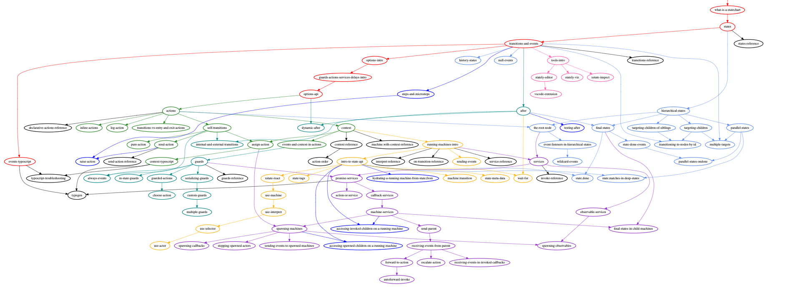
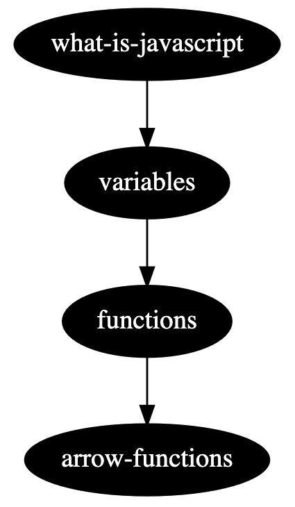
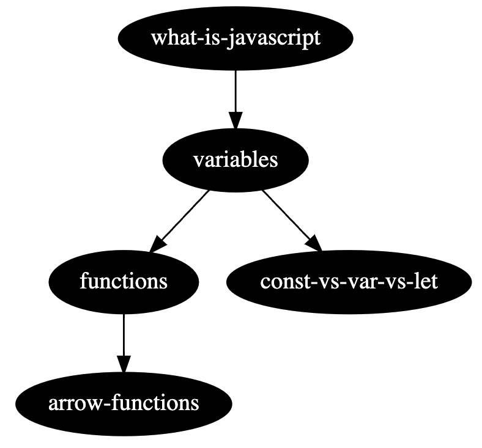

# Graph Docs CLI

Revolutionise your docs with tools for building a knowledge graph from markdown.



## Quickstart

1. [Install `graphviz`](https://graphviz.org/download)
2. Install with `yarn add -D graph-docs-cli`
3. Create a folder called `modules`, and create two files: `one.md` and `two.md`
4. Inside `two.md`, add this markdown frontmatter:

```yaml
---
deps: [one] # the filename of the module, without the .md extension
---
```

5. Run `yarn graph-docs dev "./modules/*.md"`
6. On [localhost:3001](http://localhost:3001), you'll see a graph of modules which will live-update based on changes you make to the deps.

## What is this?

My name's [Matt](https://twitter.com/mpocock1), and I'm a developer advocate at [Stately](https://stately.ai). I was working on restructuring [XState's documentation](https://xstate.js.org/docs/), and I noticed something.

The docs were not designed to be read in order. On each page, they referenced pieces of information that the viewer hadn't understood yet. There was advanced information mixed in to beginner concepts. Fundamental subjects were left too late. The docs were not **organised around a desired learning path for the user**.

I wanted to change this - and, as a developer, I wanted a data structure to help me. I chose a directed graph. I wanted to extract each piece of information from the docs into its own, small module - and have each module express its _direct_ dependencies to other modules.

### Modules

For instance - let's say you want to understand how to write an arrow function in JavaScript: `() => {}`. To understand that, you'll need to walk a path like this:

```
Arrow functions -> Normal functions
Normal functions -> Variables
Variables -> What is JavaScript?
```

Which, when put through graphviz, looks like this:



Let's imagine you also wanted to add `const vs var vs let` - you don't need to know about arrow functions for that, but you do need to know about variables:



What you end up with is a graph of **optimal paths to learn any piece of information**. This is extremely powerful for several reasons:

- You can provide **autogenerated paths based on what a user wants to learn** (for instance a specific example, or integration)
- **Maintenance of docs becomes a lot easier**. New modules can be slotted into the dependency graph easily.
- **Authoring modules becomes more declarative**. It's a lot easier to write a module when you know _exactly_ what pieces of information the user knows.

### Circular dependencies

Modules of information are similar to modules of code - both can contain [circular dependencies](https://en.wikipedia.org/wiki/Circular_dependency). In a docs page, this can result in **two pieces of information where understanding one depends on understanding the other**. This can result in a terrible learning experience. The learner has to read both modules fully, and only at the end (or perhaps on a re-read) will they understand the full picture.

In graph-docs, circular dependencies are not allowed. If you attempt it, you'll get a `maximum call stack exceeded` error in the CLI.

This constraint _forces_ you to resolve the circular dependency the way you would in code - by either:

- Extracting out the relevant bits to a new module
- Colocating the modules into one big one (if they cannot be taught separately)

This is also what makes `graph-docs` different from something like [Roam](https://roamresearch.com/)/[Obsidian](https://obsidian.md/). These tools are _fantastic_ for note-taking. But the fact that they allow circular dependencies makes them unoptimized for readers other than their author.

### Groupings

When your graph gets to 100+ modules, it can be hard to see the wood through the trees. You'll naturally want to start grouping them together.

Most docs sites will need a kind of grouping anyway, for menu organisation etc.

To add groups, follow these steps:

1. Add a graph-docs.json, containing this JSON:

```json
{
  "groups": [
    { "id": "basics", "color": "red" },
    { "id": "advanced", "color": "forestgreen" }
  ]
}
```

2. Add `group: advanced` to the frontmatter of one of the files, for instance:

```yaml
---
group: advanced
---
```

You'll see the relevant node in the graphviz will turn green.

### Integrations

Currently, there are no custom integrations with docs platforms as part of this package. We should add some!

For the XState docs, we've written a custom integration where we construct pages out of modules using a handlebars-style syntax:

```md
# States

<!-- Links to the states.md module -->

{{ states }}

## Final States

<!-- Links to the final-states.md module -->

{{ final-states }}
```

(This isn't open-source yet, but will be when we release it.)

But we should offer this as part of `graph-docs`. Any thoughts appreciated in issues!
